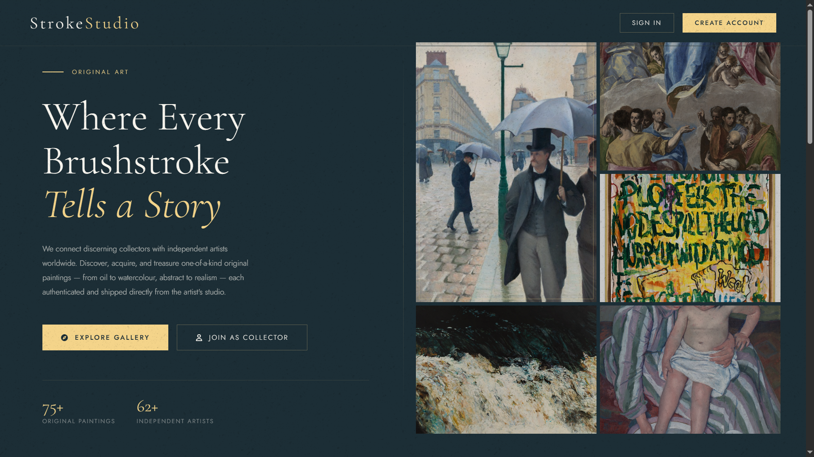
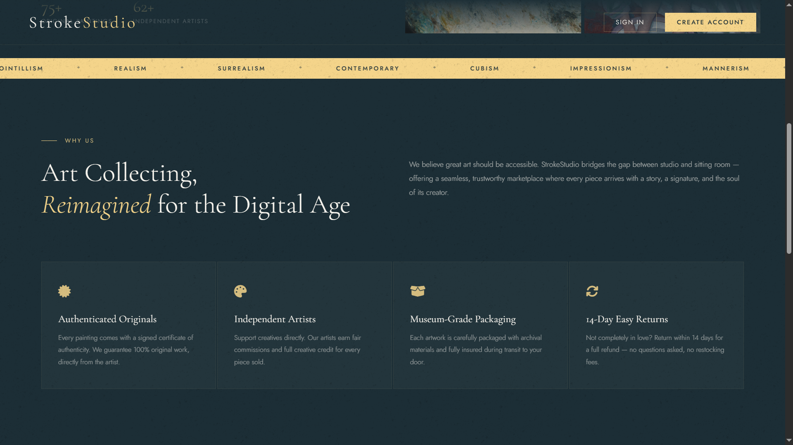
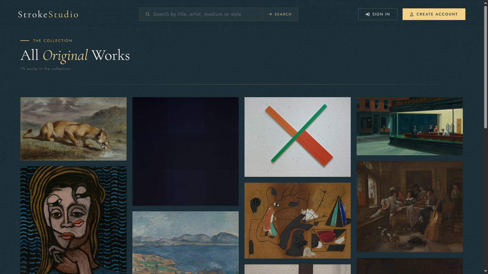
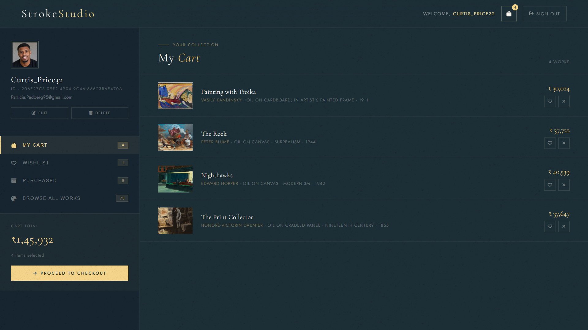
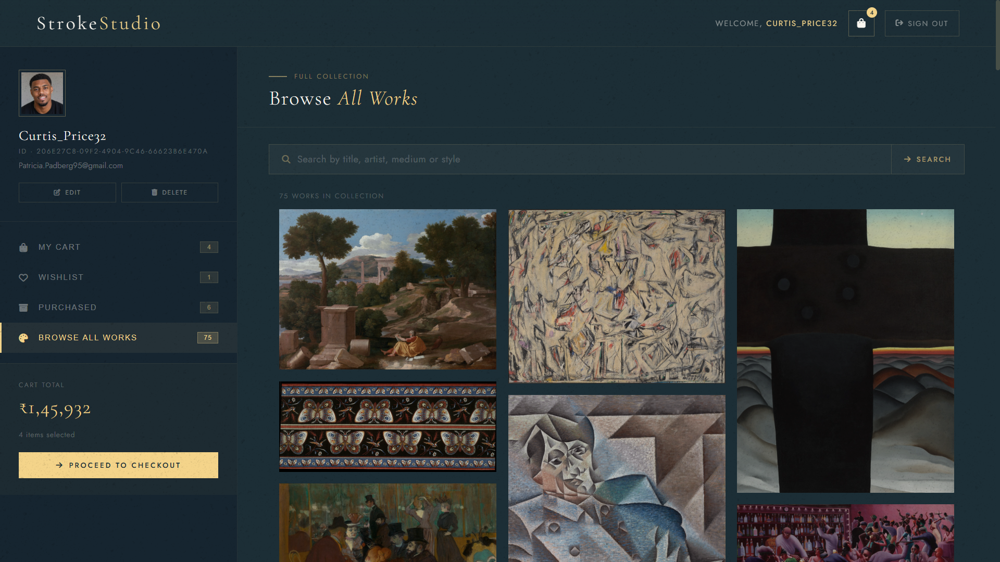
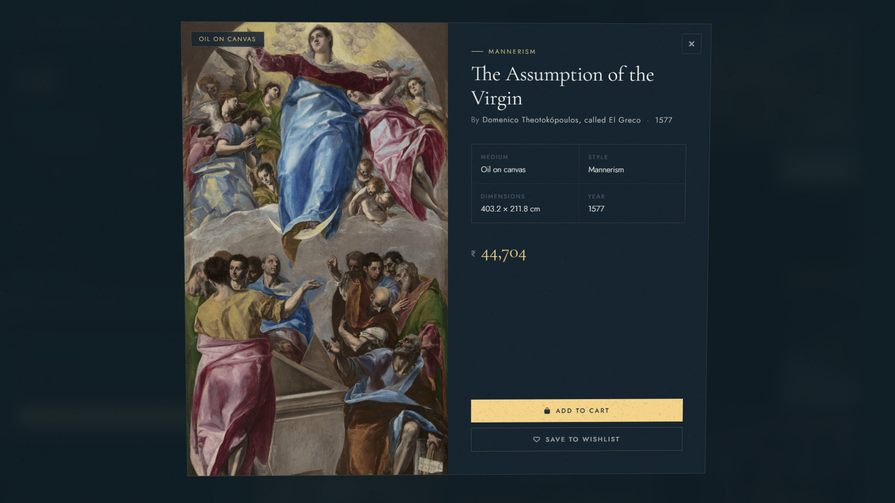

# 🎨 Stroke Studio

Stroke Studio is a full-stack web application that serves as an online **art gallery and marketplace**. Users can explore paintings, manage their personal collections, and purchase artworks.

---

## 📌 Overview

The platform allows users to:

* Create accounts and manage sessions
* Browse a curated collection of paintings
* Add artworks to cart and wishlist
* Track purchased paintings
* Upload custom avatar using Cloudinary

---

## 📌 Features

*  User Authentication (Login/Register with sessions)
*  Art Gallery with detailed painting information
*  Cart & Wishlist Management
*  Personalized User Dashboard
*  Cloudinary Image Upload Integration
*  Responsive UI using EJS templates

---

## 🛠️ Tech Stack

### Frontend

* HTML / EJS
* CSS
* JavaScript

### Backend

* Node.js
* Express.js
* MongoDB + Mongoose

### Tools & Services

* Cloudinary
* Multer
* Express-Session
* Axios
* Dotenv
* Faker (data generation library)
* UUID

---

## 📸 Screenshots

### 🏠 Home Page

#### 🔹 Home — Hero Section


#### 🔹 Home — Why Choose Stroke Studio


### 🖼️ Gallery


### 👤 User

#### 🔹 User — Cart Section


#### 🔹 User — Gallery Section


#### 🔹 User — Artwork Detail


---

## ⚙️ Installation

```bash
# Clone the repository
git clone <your-repo-link>

# Navigate to backend
cd BackEnd

# Install dependencies
npm install

# Start MongoDB locally
# (Ensure MongoDB is running)

# Initialize database by seeding paintings and fake users
node src/init/seedPaintings.js
node src/init/seedUsers.js

# Run the server
node src/index.js
```

---

## 🔐 Environment Variables

Create a `.env` file in the root directory:

```env
CLOUD_NAME=your_cloudinary_name  
API_KEY=your_api_key  
API_SECRET=your_api_secret  
```

---

## 📁 Project Structure

```
 📦 Stroke-Studio
├── 📁 A) FrontEnd/              # Frontend static files and templates
│   ├── 📁 Images/               # Local image assets (Contains images(paintings) downloaded directly of URLs from the ImageURLs.txt file)
│   ├── 📁 Markup(HTML)/         # EJS templates (myGallery.ejs, myHome.ejs, userSpace.ejs)
│   ├── 📁 Script(JS)/           # JavaScript files (myGallery.js, myHome.js, userSpace.js)  
│   ├── 📁 Style(CSS)/           # CSS stylesheets (myGallery.css, myHome.css, userSpace.css)  
│   └── 📄 ImageURLs.txt         # Contains painting URLs
├── 📁 B) BackEnd/               # Node.js backend application
│   ├── 📁 src/                  # Source code for the backend
│   │   ├── 📁 config/           # Database configuration (db.js)
│   │   ├── 📁 controllers/      # Route logic (gallery, home, user controllers)
│   │   ├── 📁 init/             # Scripts to initialize/seed database for the first time
│   │   ├── 📁 middleware/       # Custom middleware functions
│   │   ├── 📁 models/           # Mongoose schemas (list.js, user.js)
│   │   ├── 📁 routes/           # Express routes mapping
│   │   ├── 📄 app.js            # Express application setup
│   │   └── 📄 index.js          # Entry point and server initialization
│   ├── 📄 package.json          # Node.js dependencies and scripts
│   └── 📄 package-lock.json     # Exact dependency versions
├── 📁 Uploads/                  # Directory for local uploads
├── 📄 .env                      # Environment variables
├── 📄 .gitignore                # Git ignored files
└── 📄 README.md                 # Project documentation
```

---

## 📌 Future Improvements

* Payment Gateway Integration
* Admin Panel for managing artworks
* Deployment (Render / Vercel / AWS)

---

## 👤 Author

**Anshumaan Sai Patnaik**

* GitHub:  https://github.com/Anshumaan-Sai-Patnaik  
* LinkedIn:  https://www.linkedin.com/in/Anshumaan-Sai-Patnaik